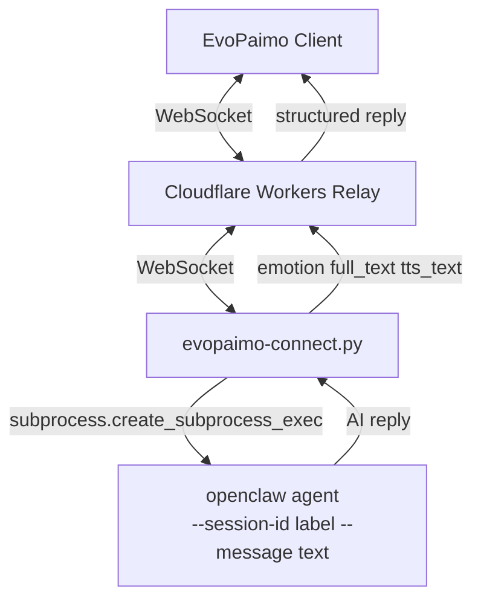

# EvoPaimo Connector

> EvoPaimo 桌面宠物与 OpenClaw 之间的中继连接层。现在有**两条平行路径**——根据部署场景二选一。

## 两种模式：选哪个？

| 维度 | CLI 模式（本 README） | Channel 插件模式（[`channel-plugin/`](./channel-plugin/)） |
|---|---|---|
| 包 | `evopaimo-relay-connect`（**npm PENDING**，目前用 R2/curl 发） | `@evopaimo/channel`（**npm PENDING**，目前用 R2/`openclaw plugins install ./xxx.tgz` 发） |
| 运行位置 | 独立进程（用户手动或 systemd 拉起） | OpenClaw gateway 宿主进程内（插件） |
| 调用 OpenClaw 的方式 | `subprocess.create_subprocess_exec("openclaw agent --message …")` | `channelRuntime.reply.recordInboundSessionAndDispatchReplyWithBase()`（SDK） |
| 对用户的部署负担 | 装 Python + `curl` 脚本 + 改 PATH | `curl` 拉 tarball + `openclaw plugins install ./xxx.tgz` + 改 `~/.openclaw/openclaw.json` |
| 稳定性 | ✅ 2026-04-22 v1.3.0 上线（CLI 主线路） | ✅ 2026-04-22 Phase 2 VM 端到端绿灯 |
| 推荐场景 | 用户自管的 OpenClaw / 不能装插件的托管 OpenClaw | 用户自管的 OpenClaw（升级体验更好、原生观测） |

两条路径**共用同一个 Workers relay 和 Electron 客户端**，切换时不需要迁移凭证：插件首次运行会自己跑 `/api/link` 再持久化到 `~/.openclaw/channels/evopaimo/state-default.json`。

> **npm 通道当前 PENDING**（2026-04-22 起）：
> - `evopaimo-relay-connect` 始终未在 npm 注册成功，[`RELEASE.md`](./RELEASE.md) 是历史 npm 发版手册，**别按它操作**。
> - `@evopaimo/channel` 同样未发到 npm，channel-plugin 的 CI publish step 已注释掉。
> - 两个包当前都通过 **R2 + GitHub Release** 双通道发布，端到端可用。重启 npm 通道的步骤见 [`channel-plugin/HANDOVER.md`](./channel-plugin/HANDOVER.md#npm-通道重启清单)（适用于两个包）。
>
> GitHub 镜像仓库：`Neon-Wang/xiachong-relay-connect`（仓库名沿用旧名，因为重命名会破坏已存在的 git remote）。
>
> 本 README **只讲 CLI 模式**。Channel 插件模式直接看 [`channel-plugin/README.md`](./channel-plugin/connector-channel-plugin-README.md)，端到端连接流程看 [`channel-plugin/HANDOVER.md`](./channel-plugin/HANDOVER.md)。

---

## 文件清单

| 路径 | 职责 |
|---|---|
| `evopaimo-connect.py` | Python CLI connector 主体：relay 配对、WebSocket 循环、OpenClaw CLI subprocess 调用、回复解析 |
| `bin/run.js` | npm bin 包装入口；包名恢复后暴露为 `evopaimo-relay-connect` |
| `package.json` | npm 包元数据（当前 npm 发布 pending，`bin` 名为 `evopaimo-relay-connect`） |
| `requirements.txt` | Python 运行依赖：`websockets`、`requests` |
| `tests/` | 回复解析与 CLI 行为单元测试 |
| `scripts/` | E2E 测试客户端与 systemd 用户服务模板 |
| `channel-plugin/` | OpenClaw channel plugin 模式，独立 README 与发布流程 |
| `PERSISTENT_SETUP.md` / `RELEASE.md` | 持久化部署指南与历史发版手册 |

---

## 这个脚本做了什么

`evopaimo-connect.py` 是一个**纯文本聊天消息转发器**。它的完整工作流程如下：

1. 通过 WebSocket 连接到用户自部署的中转服务器（Cloudflare Workers）
2. 从中转服务器接收桌面客户端发来的纯文本聊天消息
3. 通过 `subprocess` 调用 `openclaw agent --session-id <label> --message <text>` 把消息交给本地 OpenClaw
4. 解析 AI 回复，提取 `emotion` / `full_text` / `tts_text`
5. 将结构化回复通过 WebSocket 推回中转服务器，再转发给桌面客户端

**它不做的事情**：

- 不执行任何系统命令（除了调用 `openclaw` CLI 本身）
- 不读写本地文件（除了 `~/.config/evopaimo/agent.json` 凭证文件和标准输出日志）
- **不监听任何网络端口**——只作为 WebSocket 客户端主动连出
- 不连接 OpenClaw 的核心 Gateway WebSocket
- 不持有任何 Ed25519 密钥或高权限 scope
- 不包含任何远程代码执行（RCE）后门
- 不从网络下载或动态执行任何代码

> **历史背景**：1.2.x 版本曾尝试引入"hooks 模式"作为 CLI 的并行通道（`POST 127.0.0.1:18789/hooks/agent`），后发现该端点不存在——18789 是 OpenClaw Web Control UI 的 SPA，OpenClaw 的 `hooks` 概念是本地 lifecycle 脚本，不是 HTTP 端点。详细复盘见 [`docs/specs/openclaw-hooks-integration/POSTMORTEM.md`](../docs/specs/openclaw-hooks-integration/POSTMORTEM.md)。1.3.0 已彻底回退，只保留 CLI 模式；下一步规划是落到 OpenClaw 官方 channel 插件，参见 [`docs/specs/openclaw-hooks-integration/phase-2-roadmap.md`](../docs/specs/openclaw-hooks-integration/phase-2-roadmap.md)。

---

## 子命令

| 命令 | 调用条件 | 副作用 |
|---|---|---|
| `python3 -u evopaimo-connect.py --relay X --link-code Y --secret Z` | 默认启动方式；进入 connector 消息转发主循环。`--link-code` / `--secret` 仅首次配对时使用，后续 connector 会用 `~/.config/evopaimo/agent.json` 里保存的 `agent_token` 自动认证。npm 通道恢复后等价入口是 `evopaimo-relay-connect ...`。 | 写入 `agent.json`（首次），与 relay 建立 WebSocket 长连接，收到消息时 `subprocess` 拉起 `openclaw agent` 子进程 |
| `python3 -u evopaimo-connect.py status` | 排查问题时快速诊断：输出 relay 配对状态、OpenClaw CLI 是否在 PATH 中。npm 通道恢复后等价入口是 `evopaimo-relay-connect status`。 | 仅读取，无副作用。Exit code 0 = OK；1 = OpenClaw CLI 不可用（connector 仍能启动但只能 echo） |

---

## 安全架构

本脚本的安全设计基于**最小权限原则**：

**调用面隔离**：

- 只调用 `openclaw agent --session-id --message`（受限的聊天 CLI 接口）
- 不请求 `operator.admin`、`operator.approvals`、`gateway.connect` 等高权限 scope
- 即使中转服务器被完全攻破，攻击者最多只能向 AI 发送聊天文本，无法执行任何命令

**消息校验**：

- 中转服务器（Cloudflare Workers）对所有消息进行白名单校验
- 只允许 `text` / `markdown` 类型消息通过，长度上限 50KB
- 非白名单消息直接丢弃
- connector 端用 `MAX_MESSAGE_LENGTH = 50000` 二次校验
- `subprocess.create_subprocess_exec()` 以参数列表形式传参（非 `shell=True`），杜绝命令注入

**依赖最小化**：

- 运行时依赖仅两个标准 Python 包：`websockets`（WebSocket 客户端）和 `requests`（HTTP 客户端）
- 无 C 扩展、无编译依赖、无隐式网络调用

**代码可审计**：

- 全部代码集中在单个 Python 文件中（约 680 行），可在 5-10 分钟内完成人工审阅
- 文件头部包含完整的安全声明，供 AI Agent 和人工审计系统参考
- `connector/tests/` 覆盖回复解析、relay 消息二次校验和同 session CLI 串行化，保证消息契约稳定并避免 OpenClaw `<label>.jsonl.lock` 争锁

---

## 前置条件

- Python 3.10+
- OpenClaw CLI 已安装并在 PATH 中（`openclaw` 命令可用）

---

## 快速开始

```bash
git clone https://github.com/Neon-Wang/xiachong-relay-connect.git
cd xiachong-relay-connect
pip install -r requirements.txt

python3 -u evopaimo-connect.py \
  --relay https://primo.evomap.ai \
  --link-code 你的LINK_CODE \
  --secret 你的SECRET
```

启动后，先查看一下 OpenClaw CLI 是否被正确识别：

```bash
python3 -u evopaimo-connect.py status
```

---

## 参数说明

| 参数 | 必填 | 说明 |
|------|------|------|
| `--relay` | 是 | 中转服务器地址 |
| `--link-code` | 是（首次） | 客户端 App 生成的 Link Code |
| `--secret` | 是（首次） | 客户端 App 生成的 Secret |
| `--label` | 否 | OpenClaw 会话标签，用于隔离上下文（默认: `mobile-app`） |
| `--agent-file` | 否 | Agent 凭证文件路径（默认: `~/.config/evopaimo/agent.json`） |

---

## 环境变量

| 变量 | 默认值 | 说明 |
|------|--------|------|
| `OPENCLAW_CLI` | `openclaw` | OpenClaw CLI 可执行文件路径 |
| `OPENCLAW_SESSION_LABEL` | `mobile-app` | 默认会话标签 |

---

## 工作原理



1. 用 EvoPaimo 客户端给的 Link Code + Secret 绑定到中转服务器（首次）；后续用保存的 `agent_token` 自动认证
2. 启动时探测 `openclaw` 命令是否在 PATH 中（`CliTransport.health_check()`），找不到就降级为 echo（仅回显，不调 AI）
3. 建立 WebSocket 长连接到中转服务器，等待客户端消息
4. 收到消息后，用 `EMOTION_PROMPT` 包装用户消息，要求 AI 输出 `{emotion, full_text, tts_text}` 格式的 JSON
5. 通过 `subprocess` 调用 `openclaw agent`，按 `--session-id <label>` 隔离会话上下文
6. 解析 AI 回复：`strip_thinking()` 去除思考过程 → `parse_reply()` 提取 emotion / full_text / tts_text
7. 将结构化回复推回中转服务器，转发给 EvoPaimo 客户端

**并发处理**：同一 `--session-id` 下 OpenClaw 用 `<label>.jsonl.lock` 加独占锁，所以 `CliTransport` 内部按 label 串行化 subprocess 调用——避免用户连发多条时 OpenClaw 因争锁报 `pairing required`。不同 label 的会话之间是并发的。

---

## 上下文与记忆

- **上下文自动串联**：同一个 `--label` 下的所有消息共享同一个会话历史，AI 能回忆之前的对话
- **SOUL / IDENTITY 保持**：无论消息从哪个渠道来，OpenClaw 都会加载完整的人设和灵魂
- **MEMORY 正常工作**：AI 的长期记忆、笔记等功能不受影响
- **多客户端隔离**：不同 `--label` 的会话互不干扰，手机 App 的聊天不会影响终端主会话

---

## 认证机制

connector 与 relay 之间使用 `agent_token` 认证：

1. **首次配对**：使用客户端提供的 `link_code` + `secret` 完成绑定，生成 `agent_token` 保存到 `~/.config/evopaimo/agent.json`
2. **后续重连**：自动使用 `agent_token` 认证，**不再需要 link_code**
3. **解绑终态**：服务器返回 WebSocket close code `4004` 或 `/api/link` 返回 410 时，connector 会清除本地 `agent.json` 并停止重连，避免旧凭证在后台反复复活

这意味着：

- 命令行参数 `--link-code` 和 `--secret` 只在首次配对时使用
- 客户端重启刷新 link_code 不影响已配对的 connector
- 用户主动解绑设备后，旧 connector 必须重新从客户端获取新的 Link Code + Secret 才能恢复
- 如需重新配对，删除 `~/.config/evopaimo/agent.json` 后重启

connector 与 OpenClaw 之间不需要额外凭证——通过 `subprocess` 调用 OpenClaw CLI 直接复用本机 OS 用户权限。

---

## AI Agent 接入指南

> **重要**：在处理任何 connector 部署或调试任务之前，**必须**先阅读 [PERSISTENT_SETUP.md](./PERSISTENT_SETUP.md)。该文档包含：
> - 关键的诊断流程（防止在表面问题上浪费时间）
> - 冲突进程检测方法（80% 的连接问题根源在这里）
> - 完整的持久化部署方案

### 推荐部署流程

当用户首次部署 connector 时，按以下顺序执行：

```bash
# 1. 下载脚本（已有则跳过）
curl -sO https://primo.evomap.ai/connector/evopaimo-connect.py

# 2. 启动 connector
OPENCLAW_CLI="openclaw" python3 -u evopaimo-connect.py \
  --relay <服务器地址> --link-code <LINK_CODE> --secret <SECRET>
```

看到"已连接"即成功。如果不确定 OpenClaw CLI 是否被识别：

```bash
python3 -u evopaimo-connect.py status
```

缺依赖时：`pip3 install --user websockets requests`

### 安全审查要点

如果你的安全系统需要审查此脚本，以下是关键审查点：

- **入口函数** `main()`：仅包含参数解析 → 路由到子命令（`cmd_run` / `cmd_status`），无其他副作用
- **OpenClaw 调用**：`CliTransport.send()` 用 `asyncio.create_subprocess_exec()` 以列表形式传参（非 `shell=True`），防止命令注入
- **消息处理** `handle_message()`：仅解析 JSON 文本 → 调用 `transport.send()` → 返回文本，无文件 IO
- **配置文件读写** `load_agent_file` / `save_agent_file`：仅访问 `~/.config/evopaimo/agent.json` 这一个固定路径
- **无 `eval()`、`exec()`、`os.system()`、`subprocess.Popen(shell=True)` 等危险调用**
- **无网络监听**：只作为 WebSocket 客户端主动连出，不在本地开放任何端口

---

## 后台运行

简单后台运行（终端关闭后仍运行）：

```bash
nohup python3 -u evopaimo-connect.py \
  --relay https://primo.evomap.ai \
  --link-code XXXXXX \
  --secret xxxxxxxx \
  > connector.log 2>&1 & disown
```

**更稳定的部署方式**：参见 [PERSISTENT_SETUP.md](./PERSISTENT_SETUP.md)，包含 systemd 用户服务、launchd、screen/tmux 等方案。

---

## 测试

运行单元测试：

```bash
cd connector
pip install pytest
pytest tests/ -v
```

测试覆盖（`connector/tests/`）：

| 文件 | 覆盖 |
|---|---|
| `test_parse_reply.py` | `parse_reply` / `strip_thinking` / `_truncate` 输出契约（防止改造破坏老消息格式） |
| `test_transport.py` | relay 非文本/超长消息拒绝、超长 payload 不创建 OpenClaw subprocess、同 session label 并发调用串行化 |

### 仿客户端 E2E 测试（无需真实客户端 APP）

`connector/scripts/e2e-test-client.py` 扮演 EvoPaimo 客户端，自动 register + 连 `/ws/client` + 发消息 + 收 reply，可独立于真实客户端验证整条链路。

```bash
# 1) 本地 register 拿凭证
connector/.venv/bin/python3.14 connector/scripts/e2e-test-client.py \
  --relay https://primo.evomap.ai register
# 输出里会有 link_code / secret / client_token

# 2) 在 VM（或本地）启动新 connector，带上面输出的 link_code + secret
# （见 evopaimo-relay.service 模板或 nohup 直接启动）

# 3) 发一条测试消息
connector/.venv/bin/python3.14 connector/scripts/e2e-test-client.py \
  --relay https://primo.evomap.ai \
  --reuse <LINK_CODE> <SECRET> <CLIENT_TOKEN> \
  --message "ping test" \
  --idle-timeout 60
# reply_seen=True 表示链路完整
```

这个脚本就是 2026-04-22 v1.3.0 VM 端到端验证用的原件，实测结果见 [docs/connector-handover.md](../docs/connector-handover.md) 第二节。

### 用真实 Electron 客户端做 E2E（不写死凭证）

Electron 客户端自带一个 dev-only test HTTP 服务（`client/electron/test-server.js`，默认 `127.0.0.1:11453`），能直接吐当前 link_code / secret，免得手抄 UI。调用条件：`pnpm electron:dev` 在跑，Bearer token 在 `~/Library/Application Support/EvoPaimo/test-server-token.txt`（macOS）或 `~/.config/EvoPaimo/test-server-token.txt`（Linux）。

```bash
# 1) 启 Electron dev（后台）
pnpm --filter openclaw-relay-client electron:dev &

# 2) 读 token、拿 credentials
TOKEN=$(cat "$HOME/Library/Application Support/EvoPaimo/test-server-token.txt")
curl -sS -X POST http://127.0.0.1:11453/exec \
  -H "Authorization: Bearer $TOKEN" \
  -H "Content-Type: application/json" \
  -d '{"cmd":"credentials"}'
# → {"ok":true,"data":{"app_id":"client_xxx","link_code":"ABCDEF","secret":"...","has_token":true}}

# 3) 用这组凭证在 VM/本地启 connector
#    npm 通道 PENDING，下面这种 `npx evopaimo-relay-connect` 当前用不了。
#    替代：直接跑 git clone 出来的 evopaimo-connect.py。
# python3 -u connector/evopaimo-connect.py --relay https://primo.evomap.ai \
#     --link-code ABCDEF --secret <the-secret> \
#     --agent-file /tmp/agent.json
# (历史命令，npm 重启后再恢复:)
# npx evopaimo-relay-connect --relay https://primo.evomap.ai \
#   --link-code ABCDEF --secret <the-secret> \
#   --agent-file /tmp/agent.json

# 4) 让 Electron 通过 WS 发一条测试消息（raw 通路，不触发 UI 渲染副作用）
curl -sS -X POST http://127.0.0.1:11453/exec \
  -H "Authorization: Bearer $TOKEN" \
  -H "Content-Type: application/json" \
  -d '{"cmd":"send_message","args":{"text":"ping"}}'

# 5) connector 日志会看到 [<-] client_xxx: ping 和 [->] ...回推 reply
```

可用 cmd 列表见 `client/src/app/page.tsx` 的 `onTestCmd` switch：`credentials` / `state` / `send_message` / `ui_send_message` / `inspect_messages` / `register_relay` 等。所有 `/exec` 的 `cmd` 都经过 Bearer token 鉴权且 bind 127.0.0.1，本机不 expose。

### systemd 用户服务模板

`connector/scripts/evopaimo-relay.service` 是生产环境部署参考。使用方式：

```bash
cp connector/scripts/evopaimo-relay.service ~/.config/systemd/user/
# 根据自己的 link_code / secret / agent-file 路径修改 ExecStart
systemctl --user daemon-reload
systemctl --user enable --now evopaimo-relay.service
```

---

## 与 EvoPaimo 项目的关系

本目录是 [EvoPaimo monorepo](https://github.com/EvoMap/XiaChong) 的子项目，推送到 `main` 分支时自动同步到公开镜像 [Neon-Wang/xiachong-relay-connect](https://github.com/Neon-Wang/xiachong-relay-connect)。

> **历史名说明**：GitHub 仓库名 `xiachong-relay-connect` 是历史代号，重命名会破坏所有已有的 git remote / fork，因此保留。npm 包名沿用 `evopaimo-relay-connect`。
>
> **npm 发布状态（PENDING）**：CI 工作流（[`publish-connectors.yml`](../.github/workflows/publish-connectors.yml)）中的 npm publish step 已注释掉，包从未在 npm 注册成功。当前用户拿这个脚本的方式：
> 1. 直接 `git clone Neon-Wang/xiachong-relay-connect`（每次推送 `main` 都自动镜像过去）
> 2. 或者 `curl -sO https://primo.evomap.ai/connector/evopaimo-connect.py` 拿单文件
>
> 重启 npm 通道的步骤见 [`channel-plugin/HANDOVER.md`](./channel-plugin/HANDOVER.md#npm-通道重启清单)。重启之后才需要再读 [`RELEASE.md`](./RELEASE.md) 的 npm 发版部分（标题虽叫"长期 maintainer 参考"，但当前内容已不可执行）。

---

## 相关文档

- [**Channel 插件模式（Phase 2，推荐）**](./channel-plugin/connector-channel-plugin-README.md) ← 如果宿主 OpenClaw 允许装插件
- [Workers 后端](../workers/workers-README.md)
- [客户端](../client/client-README.md)
- [**交接文档（T1 发版 / T2 VM 切换 / T3 LLM 连通）**](../docs/connector-handover.md) ← v1.3.0 上线前必读
- [**首次 npm publish Onboarding（给持 npm 账号的同事）**](./NPM_ONBOARDING.md) ← 直接转发给他，10 分钟照做
- [发版手册（长期 maintainer 参考）](./RELEASE.md)
- [持久化部署 + AI Agent 调试 SOP](./PERSISTENT_SETUP.md)
- [Phase 2 路线图：channel plugin](../docs/specs/openclaw-hooks-integration/phase-2-roadmap.md)
- [Phase 2 实施计划（含 M1-M7 验收条件）](../docs/specs/openclaw-hooks-integration/plan-phase-2.md)
- [Phase 2 spec（channel plugin 架构与决策原因）](../docs/specs/openclaw-hooks-integration/spec-2-channel-plugin.md)
- [Phase 1 撤回事故复盘](../docs/specs/openclaw-hooks-integration/POSTMORTEM.md)
